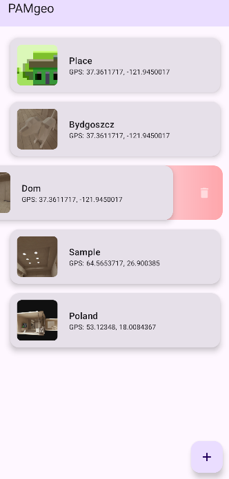
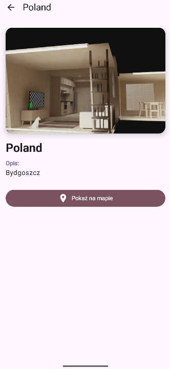

# PAMgeo (v1.0 MVP)
Projekt semestralny realizowany w ramach przedmiotu `Programowanie Urządzeń Mobilnych`. Aplikacja
do zapisywania miejsc wraz ze zdjęciem i lokalizacją GPS, możliwość przekierowania do `Google Maps`.

[Instrukcja do projektu](docs/Projekt_mobilny.pdf)

## Zrzuty Ekranu
 

## Status projektu
Projekt został zainicjowany w oparciu o kod z Laboratorium 11 (struktura MVVM, Navigation Compose).
### Dodane funkcjonalności:
* **Create, Read, Delete** - Możliwość tworzenia, wyświetlania i usuwania miejsc
* **Obsługa Aparatu** - Wykonywanie zdjęć i wyświetlanie miniatur `(Camera Intent, FileProvider)`
* **Lokalizacja GPS** - Pobieranie aktualnych współrzędnych geograficznych `(lat, lng)`
* **Baza Danych** - Zapis do lokalnej bazy danych `(Room Database)`
* **Swipe-Delete** - Usuwanie elementu listy przez przesunięcie palcem wraz z animacją `(gradient)`
* **Google Maps** - Przekierowanie do `Google Maps` w widoku szczegółów `DetailsScreen`

## TODO
### Lista planowanych funkcji:
* [ ] **Edycja wpisów (Update)** - Możliwość zmiany tytułu, opisu lub zdjęcia w istniejącej notatce `(CRUD)`.
* [ ] **Geocoding** - Zamiana współrzędnych na adres.
* [ ] **Wyszukiwanie i Filtrowanie** - Wyszukiwanie notatek po tytule i sortowanie.
* [ ] **Eksport danych** - Możliwość udostępniania notatki do innych aplikacji `(?)`.

## Tech Stack
* **Język** - Kotlin
* **Interfejs:** Jetpack Compose `(Material Design 3)`
* **Architektura:** MVVM `(Model-View-ViewModel)`
* **Baza danych:** Room `(SQLite abstraction)`
* **Asynchroniczność:** Kotlin Coroutines & Flow
* **Obrazy:** Coil `(Ładowanie zdjęć z URI)`
* **Nawigacja:** Navigation Compose
* **Uprawnienia:** Runtime Permissions `(Camera, Fine/Coarse Location)`

## Instrukcja Uruchomienia
1. Sklonuj repozytorium.
2. Otwórz projekt w **Android Studio**.
3. Zsynchronizuj zależności Gradle (Sync Project).
4. Uruchom na emulatorze lub urządzeniu fizycznym.

---
Autor: [PabloZagrodnik]
