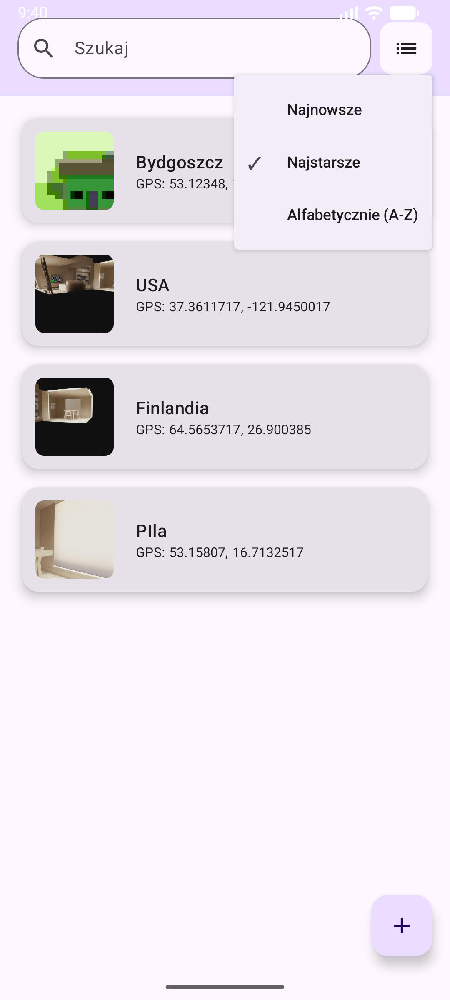
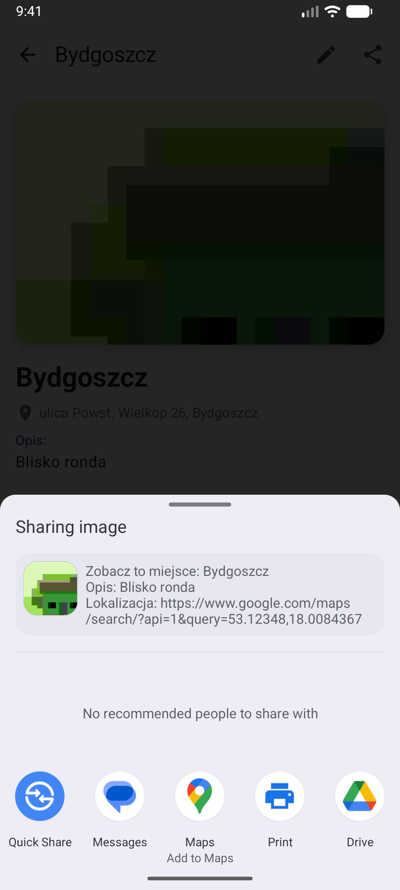

# PAMgeo (v1.1)
Projekt semestralny realizowany w ramach przedmiotu `Programowanie Urządzeń Mobilnych`. Aplikacja
do zapisywania miejsc wraz ze zdjęciem i lokalizacją GPS, możliwość przekierowania do `Google Maps`.

[Instrukcja do projektu](docs/Projekt_mobilny.pdf)

## Zrzuty Ekranu

  
  

  
  

## Status projektu
Projekt został zainicjowany w oparciu o kod z Laboratorium 11 (struktura MVVM, Navigation Compose).
### Dodane funkcjonalności:
* **Create, Read, Update, Delete** - Możliwość tworzenia, wyświetlania, edycji i usuwania miejsc
* **Obsługa Aparatu** - Wykonywanie zdjęć i wyświetlanie miniatur `(Camera Intent, FileProvider)`
* **Lokalizacja GPS** - Pobieranie aktualnych współrzędnych geograficznych `(lat, lng)`
* **Geocoding** - zmiana współrzędnych na adres.
* **Baza Danych** - Zapis do lokalnej bazy danych `(Room Database)`
* **Wyszukiwanie i Filtrowanie** - Wyszukiwanie miejsc po tytule i sortowanie.
* **Swipe-Delete** - Usuwanie elementu listy przez przesunięcie palcem wraz z animacją `(gradient)`
* **Google Maps** - Przekierowanie do `Google Maps` w widoku szczegółów `DetailsScreen`
* **Eksport danych** - Możliwość udostępniania miejsc do innych aplikacji `(Wiadomości, Poczta, Notatki)`.

## TODO
### Lista planowanych funkcji:
* **Ewentualna poprawa UI**

## Tech Stack
* **Język** - Kotlin
* **Interfejs:** Jetpack Compose `(Material Design 3)`
* **Architektura:** MVVM `(Model-View-ViewModel)`
* **Baza danych:** Room `(SQLite abstraction)`
* **Asynchroniczność:** Kotlin Coroutines & Flow
* **Obrazy:** Coil `(Ładowanie zdjęć z URI)`
* **Nawigacja:** Navigation Compose
* **Uprawnienia:** Runtime Permissions `(Camera, Fine/Coarse Location)`

## Instrukcja Uruchomienia
1. Sklonuj repozytorium.
2. Otwórz projekt w **Android Studio**.
3. Zsynchronizuj zależności Gradle (Sync Project).
4. Uruchom na emulatorze lub urządzeniu fizycznym.

---
Autor: [PabloZagrodnik]
